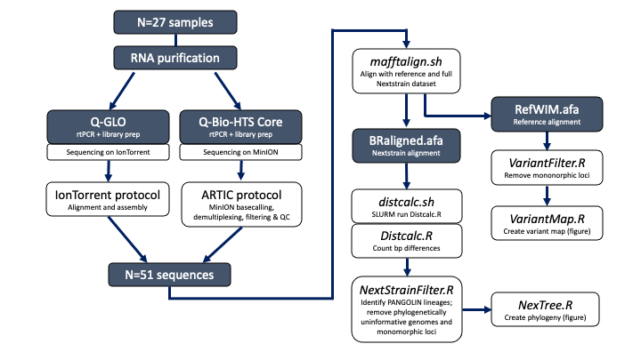

# SARS-COV-19 Analysis Pipeline

#### Analysis Files from 2020 COV-19 genome study by *Sjaarda et al*: **"Phylogenomics reveals viral evolution, sources, transmission, and superinfection in early-stage COVID-19 patients in Eastern Ontario, Canada"** https://www.biorxiv.org/content/10.1101/2020.06.25.171744v1

# Pipeline Overview

1. Download the patient genomes from <<DATADRYAD LINK>> and the latest nextstrain squence data from GISAID (https://www.gisaid.org)
    * OR to reproduce the published analysis, download the archived sequence data from <<DATADRYAD LINK>>
2. Run *mafftalign.sh* to align patient samples to GISAID aligned genomes
3. Run *VariantFilter.R* and *VariantMap.R* to remove monomorphic loci and create Variant map from consensus genomes
    * (optional) 3b. Run VariantMapNextStrain.R to identify trim sites (e.g. junk polymorphisms on 3' and 5' ends); these can be removed using the **Trim5** and **Trim3** user-defined parameters in *NextStrainFilter.R*
4. Run *Distcalc.R* to count N substitutions for each patient sample against each reference genome in the GISAID database
5. Run *NextStrainFilter.R* to remove 'clutter' (phylogenetically uninformative reference sequences and monomorphic sites) and group identical genomes shared by multiple reference IDs
6. Run *NexTree.R* to produce phylogeny

NOTES:  
  * Make sure user-defined Trim5 and Trim3 variables in Distcalc.R are same values as NextStrainFilter.R

## Current/recent Edits:
- [ ] Add link to data archive when published
- [ ] Add citation to paper when published
- [ ] Check for, and remove, unused libraries in R scripts
- [X] Combine identical reference sequences in NextTree.R
- [X] Move Trim5 and Trim3 to Distcalc.R instead of NextStrainFilter.R
- [X] Add updated Wuhan root: Wuhan/WH04/2020 (include 2019 for comparison)
- [X] Reorganize code: 
  - [X] mafftalign.sh -- reproducible alignment with defined inputs/outputs
  - [X] VariantFilter.R -- remove monomorphic loci from reference alignment
  - [X] VariantMap.R -- create variant map (figure)
  - [X] Discalc.R -- replace NextStrainSet.R; Instead of blast, conduct a pairwise comparison of each patient sample with each GISAID genome.
  - [X] NextstrainFilter.R -- filter sequences based on DiscCalc.R and remove monomorphic loci
  - [X] VariantMapNextStrain.R -- optional script to look for trim sites to use in NextStrainFilter.R
  - [X] NexTree.R -- phylogeny figure  
- [X] Add pangolin lineage names to phylogeny (A, B, B1, B1.5, etc.) in NextstrainFilter.R
- [X] (optional) find more elegant solution for write.fasta() at the end of scripts/NextStrainSetup.R
- [X] Replace BLAST filter with full-genome, pairwise comparison

### Future Plans
- [ ] Future projects: New pipeline similar to Distcalc.R + NextTree.R code but directly from .vcf? 
- [ ] Split NexTree.R into 2 scripts: 1. NexFilt2.R to filter based on polymorphisms shared with patient samples; 2. NexTree.R to estimate Phylogeny & graph
  - [ ] From NexFilt2.R save accession ID and write new script to include all polymorphisms including those in reference sequences that are not in patient samples

### Older edits
- [X] Move code from line 50 in NextStrainSetup.R to downstream (remove QGLO sequences from GISAID database). This will improve reproducibility for future runs of samples that are not already in the GISAID database.
- [X] Speed up workflow by aligning patient sequences (mafftaligh.sh) AND combining redundant sequences (DupSampleList in NextStrainAnalysis_.R) BEFORE running the BLAST to identify reference sequences.
- [X] fix blast_seq function in NextStrainSetup.R to retain more hits (currently missing important sequences)
- [X] improve efficiency in NextStrainSetup.R by modifying blast_seq function to only retain non-redundant hits (rather than saving all to memory, transforming to df f_blast_results and then removing redundant uniq_blast_results)
- [X] retain only closely-related sequences, based on BLAST analysis in NextStrainSetup.R
  
